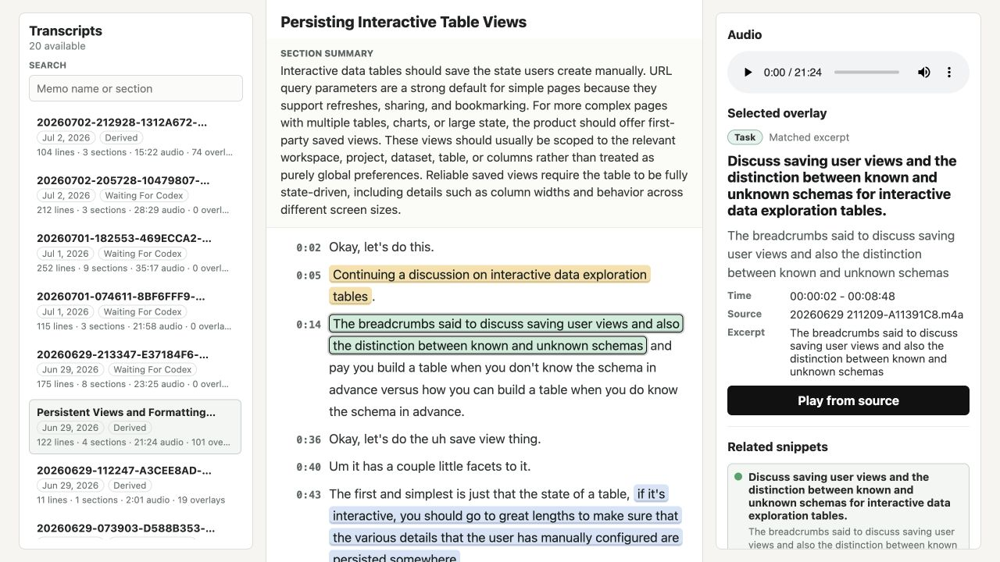
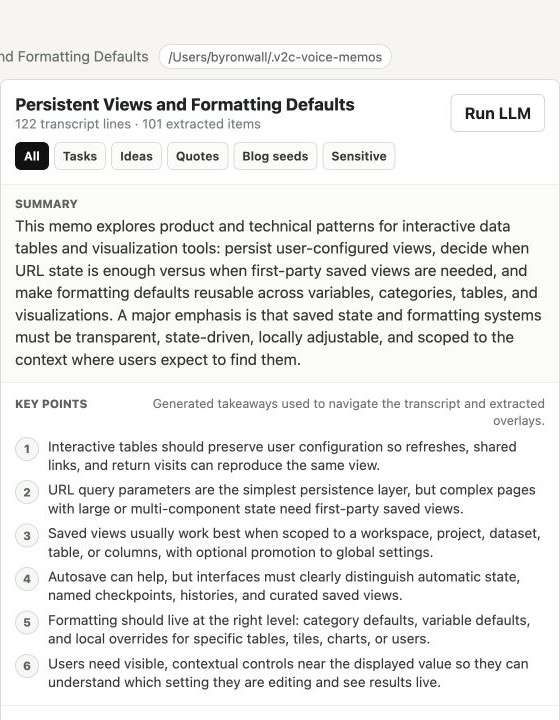
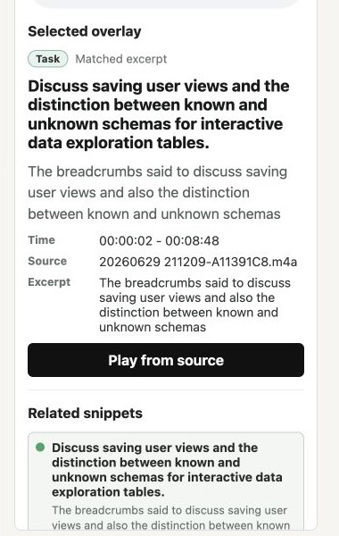

# video-to-context

Turn screen recordings and voice memos into a structured, **digestible**
context package — a timestamped transcript, screenshots and a single-image
**contact sheet** when video is present, and a self-contained **HTML report**
tying it all together — using **local** FFmpeg and Parakeet or whisper.cpp.
Transcript analysis can optionally use the OpenAI API when you pass
`--run-llm`.

The resulting folder is the artifact you hand to a person or an LLM/agent when
you want to understand or ask questions over a walkthrough, meeting, or spoken
note. On completion the CLI prints a flat list of every produced file so an
agent can consume them directly.

## Install

Prerequisites (Homebrew):

```bash
brew install ffmpeg uv
uv tool install parakeet-mlx -U
# Optional, only when using --transcriber whisper:
brew install whisper-cpp
```

If a local dependency is missing, the CLI will offer to install it for you with a
`yes/no` prompt. Use `-y` or `--yes` to approve dependency installation without
prompting.

Run it directly from npm:

```bash
npx v2ctx
```

Or install it globally:

```bash
npm install -g v2ctx
```

The published package exposes three commands: `v2ctx`, `v2c`, and
`video-to-context`.

For local development from this repo:

```bash
npm install -g .      # or: npm link
```

The repository now keeps the Node CLI implementation in `cli/` and the local
review UI in `app/`. Run the Solid/Vite review app during development with:

```bash
npm --prefix app install
npm --prefix app run dev
```

The current UI is a local transcript review workspace for generated context
packages. See [Review UI](#review-ui) for the dedicated walkthrough.

Parakeet is the default transcription backend. Whisper models are downloaded and
cached automatically on first use under `~/.cache/video-to-context/models/` when
you choose `--transcriber whisper`.

## Usage

```bash
npx v2ctx [input] [options]
```

`input` may be:

- a **video or audio file** — processed on its own
- a **directory** — every eligible media file in it (non-recursive) is concatenated
  into one timeline, with full lineage back to each source file
- **omitted** — defaults to the current directory

So you can `cd ~/Desktop && npx v2ctx` to bundle every recording on your Desktop
into one digestible package. If installed globally, use `v2ctx` in place of
`npx v2ctx`.

Supported audio-only inputs include common voice memo formats such as `.m4a`,
`.mp3`, `.wav`, `.aac`, `.caf`, `.flac`, `.ogg`, `.opus`, `.aif`, and `.aiff`.
Audio-only runs skip screenshot and contact-sheet generation automatically.

For Apple Voice Memos, use the preset:

```bash
npx v2ctx --voice-memos
```

It auto-detects the likely Voice Memos folder, writes to
`~/.v2c-voice-memos`, skips source copies and visual extraction, and opens
`report.html` when it finishes. You can still override pieces:

```bash
npx v2ctx --voice-memos --transcriber whisper -m medium --no-open
npx v2ctx --voice-memos /path/to/Voice\ Memos -o ~/Documents/memos-context
```

If macOS reports that likely Voice Memos folders exist but cannot be read,
grant Full Disk Access to your terminal app in System Settings, then rerun the
same command.

For the ongoing voice-memo workflow, use:

```bash
npx v2ctx voice-memos
```

This scans Apple Voice Memos, writes one context package per memo under
`~/.v2c-voice-memos`, skips packages that already have transcripts and
analysis, and creates `analysis/segments.json` plus
`analysis/session-digest.md` for new or previously unprocessed memos.
This is the primary "just works" path for daily use. To run the new
API-backed transcript processing, add an OpenAI API key to `.env` and pass
`--run-llm`:

```bash
OPENAI_API_KEY=...
npx v2ctx voice-memos --run-llm
```

The LLM path determines semantic sections from the full transcript, runs
whole-transcript extraction passes by item type, and writes
`analysis/transcript-summary.json`, `analysis/segment-analysis.jsonl`, and the
existing derived review artifacts.

The lower-level analysis commands remain available for repair, debugging, or
one-off package work.

The same voice-memo scan/transcribe/segment workflow is also available through
`analyze --voice-memos`:

```bash
npx v2ctx analyze --voice-memos
```

Advanced package commands, useful while the model-backed stage is still being
wired together:

```bash
npx v2ctx analyze ./demo-context
npx v2ctx analyze ./demo-context --run-llm --derive
```

Reruns are idempotent. Each output folder gets a `.v2c-manifest.json` recording
the input files and meaningful options. If you run the same command again and
the files/options still match, the CLI prints the existing outputs and exits
without extracting audio or transcribing again. Use `--force` to rebuild.

## Review UI

The Solid/Vite app in `app/` provides a local review workspace for transcript
packages, with the voice memo library on the left, a sectioned transcript in the
middle, and audio plus selected evidence on the right.



Run it during development with:

```bash
npm --prefix app install
npm --prefix app run dev
```

By default the dev server reads generated voice-memo context packages from
`~/.v2c-voice-memos` through local Vite API routes. You can also use
**Open package** to load a package directory in-browser when you want to inspect
one generated folder directly.

The workspace is built for reviewing `--run-llm` and derived analysis output:

- transcript cards show package status, audio duration, section count, and
  overlay count
- generated transcript summaries and section summaries sit above the raw lines
- extracted tasks, ideas, quotes, blog seeds, and sensitive flags are highlighted
  directly in the transcript
- the right pane shows the selected overlay's type, match quality, timestamp,
  source file, excerpt, related snippets, and a **Play from source** action
- filter buttons narrow overlays to all items, tasks, ideas, quotes, blog seeds,
  or sensitive flags
- **Run LLM** can trigger local package analysis from the selected transcript
  when the API key and local environment are configured

The transcript header keeps the package title, line and overlay counts, summary,
and generated main points visible before the raw transcript begins.





Selections are deep-linkable. The URL query parameters identify the transcript
package and selected overlay, and the hash scrolls to a transcript section:

```text
?transcript=<package-name>&snippet=<package-name>::<review-item-id>#section-<segment-id>
```

| Option | Description |
|---|---|
| `-o, --output <dir>` | Output directory (default: `<name>-context`) |
| `--transcriber <parakeet\|whisper>` | Audio-to-text backend (default: `parakeet`) |
| `-m, --model <name>` | Whisper-only model: `tiny(.en)`, `base(.en)`, `small(.en)`, `medium(.en)`, `large-v3`, `large-v3-turbo`, or a path to a `ggml-*.bin` (default: `base.en`) |
| `--decoding <mode>` | Parakeet decoding mode, e.g. `greedy` or `beam` |
| `--beam-size <n>` | Parakeet beam size when using beam decoding |
| `-l, --language <code>` | Spoken-language hint, e.g. `en` (default: auto-detect) |
| `--interval <sec>` | Seconds between screenshots (default: `10`) |
| `--scene [thresh]` | Scene-change detection instead of fixed interval (0..1, default `0.08`) |
| `--contact <n>` | Frames in the contact sheet (default: `25`; `0` disables) |
| `--voice-memos` | Auto-detect Apple Voice Memos, write to `~/.v2c-voice-memos`, skip visuals/source copies, open the report |
| `--force-analysis` | With `analyze`, rebuild existing analysis files |
| `--reset-analysis` | Delete generated `analysis/` assets before continuing |
| `--derive` | Advanced: with `analyze`, derive `tasks.jsonl`, `claims.jsonl`, `quotes.jsonl`, `blog-seeds.md`, and `review-inbox.jsonl` |
| `--run-llm` | Run OpenAI-backed transcript sectioning, extraction, and synthesis |
| `--llm-provider <provider>` | LLM provider for `--run-llm` (default: `openai`) |
| `--llm-model <model>` | OpenAI model for `--run-llm` (default: `gpt-5.4-mini`) |
| `--open` | Open `report.html` when done |
| `--no-open` | Don't open `report.html` when done |
| `--no-source` | Don't copy source media into the package |
| `--no-frames` | Skip screenshot extraction |
| `--no-transcript` | Skip transcription |
| `-y, --yes` | Answer yes to dependency installation prompts |
| `-f, --force` | Overwrite an existing output directory |
| `-h, --help` | Show help |

### Examples

```bash
# Apple Voice Memos, process only new/unprocessed memos into per-memo packages
npx v2ctx voice-memos

# Reprocess audio/transcripts for all voice memos and rebuild analysis
npx v2ctx voice-memos --force

# Keep transcripts, but delete and rebuild all generated analysis assets
npx v2ctx voice-memos --reset-analysis

# Apple Voice Memos, one reusable local context package
npx v2ctx --voice-memos

# Every media file in the current folder, concatenated with lineage
npx v2ctx

# A single recording
npx v2ctx demo.mov

# Audio-only voice memos, higher-accuracy whisper transcript
npx v2ctx ~/Desktop/voice-memos --transcriber whisper -m medium --no-source

# Audio-only voice memos, Parakeet beam decoding
npx v2ctx ~/Desktop/voice-memos --decoding beam --beam-size 5 --no-source

# Concatenate every media file on the Desktop, higher-accuracy transcript
npx v2ctx ~/Desktop --transcriber whisper -m medium

# Mostly-static UI: only capture meaningful screen changes
npx v2ctx demo.mov --scene 0.05 -o ./demo-context
```

### Advanced analysis commands

```bash
# Same as voice-memos: process new/unprocessed memos, then analyze them
npx v2ctx analyze --voice-memos

# Run full-transcript LLM sectioning and extraction for one package
npx v2ctx analyze ~/.v2c-voice-memos/20260701-182553-469ECCA2-context --run-llm --derive

# Reset one package's analysis assets, then rerun full-transcript LLM analysis
npx v2ctx analyze ~/.v2c-voice-memos/20260701-182553-469ECCA2-context --reset-analysis --run-llm --derive
```

## Output structure

```
demo-context/
  report.html              # ← open this: report + transcript + optional visuals
  contact_sheet.jpg        # 25 timestamped thumbnails in one image, when video exists
  index.md                 # plain-text/markdown index (lineage + links)
  source/                  # copies of the original media files (omit with --no-source)
  audio/audio.wav          # mono 16 kHz extracted audio (concatenated)
  frames/frame_0001.jpg …  # screenshots across the video timeline, when video exists
  .v2c-manifest.json       # input/options fingerprint used to skip reruns
  transcript/
    transcript.txt         # plain text
    transcript.srt         # timestamped
    transcript.vtt         # timestamped, when produced by the backend
    transcript.json        # structured, for scripting/search
  analysis/
    segments.json          # source scaffold, then LLM semantic section records
    segment-analysis.jsonl # validated whole-transcript extraction records
    tasks.jsonl            # derived action items
    claims.jsonl           # derived claims/opinions/experience
    quotes.jsonl           # derived quote candidates
    blog-seeds.md          # derived blog seed notes
    review-inbox.jsonl     # pending extracted items for human review
    session-digest.md      # human-readable segment digest
```

### Lineage (directory / multi-file mode)

When multiple files are combined, every screenshot and transcript segment
records both its **global** time on the combined timeline and the **source**
file + local time it came from. The HTML report and `index.md` both show a
lineage table (which file occupies which time range), including whether each
source contains audio, video, or both. The contact sheet labels each thumbnail
with its source (e.g. `S2`).

## Model guidance

Parakeet is the default and runs with explicit 120-second chunks and 15-second
overlap. For accuracy-sensitive files, try `--decoding beam --beam-size 5`.

When using `--transcriber whisper`, start with `base.en` (fast, small download).
If product names or jargon come out wrong, rerun with a larger whisper model,
such as `--transcriber whisper -m medium` or
`--transcriber whisper -m large-v3-turbo`.
